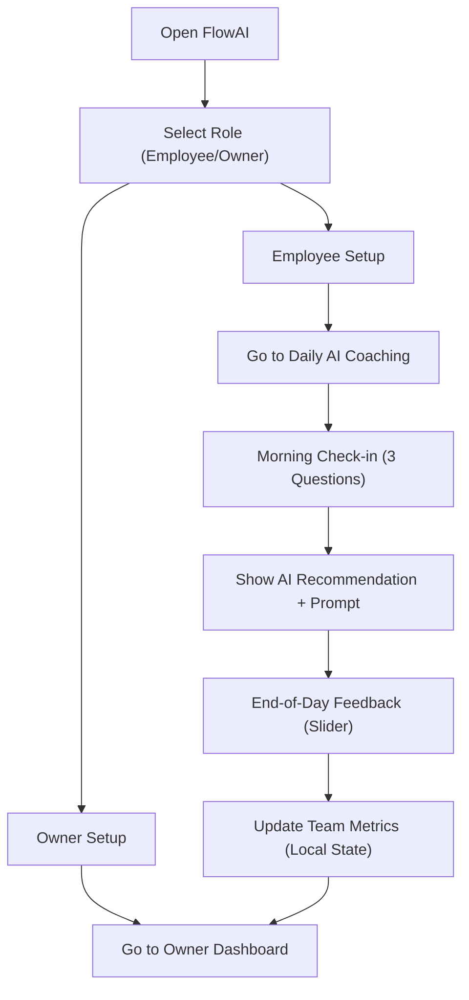

## 1. Product Overview
FlowAI is an AI Work Coach platform that helps employees use AI tools effectively each day, while giving owners/managers visibility into team AI adoption and time savings.
- Solves: “Which AI tool + prompt should I use for my work today?” and “Is my team actually adopting AI?”
- Value: faster execution, repeatable prompts, measurable time savings, improved AI adoption.

## 2. Core Features

### 2.1 User Roles
| Role | Registration Method | Core Permissions |
|------|---------------------|------------------|
| Employee | Local onboarding (name + department role) | Daily check-in, view AI recommendation, submit end-of-day feedback |
| Owner/Manager | Local onboarding (company + team size) | View team dashboard, adoption metrics, department breakdown |

### 2.2 Feature Module (Pages)
1. **Landing + Setup (/)**: role selection, lightweight onboarding
2. **Daily AI Coaching (/employee)**: morning check-in, recommendation card, end-of-day feedback
3. **Owner Dashboard (/owner)**: adoption rate, total time saved, team list, department adoption bar chart

### 2.3 Page Details
| Page Name | Module Name | Feature description |
|-----------|-------------|---------------------|
| Landing + Setup | Role selector | Choose Employee or Owner, animated transition into setup form |
| Landing + Setup | Employee setup | Capture name + role (Marketing, Sales, Finance, Developer, Operations, HR) |
| Landing + Setup | Owner setup | Capture company name + number of team members |
| Daily AI Coaching | Morning check-in form | 3 questions (today’s work, biggest time sink, AI tools tried) with validation and friendly UX |
| Daily AI Coaching | AI recommendation card | Specific AI tool suggestion + prompt template + estimated time saved |
| Daily AI Coaching | End-of-day feedback | “Did this help?” + time saved slider (0–120 min) saved to local state |
| Owner Dashboard | Adoption rate | % active today shown as large number + progress bar |
| Owner Dashboard | Total time saved | Weekly time saved shown as large number (hours) derived from demo/team feedback |
| Owner Dashboard | Team members list | Name, role, active/inactive status, time saved today |
| Owner Dashboard | Department adoption chart | Simple bar chart (active users / total per department) |

## 3. Core Process

### 3.1 Employee Flow
1. Employee opens Daily AI Coaching page.
2. Completes morning check-in (3 questions).
3. Receives a tailored recommendation: AI tool + ready-to-use prompt.
4. End of day: submits whether it helped and time saved (0–120 min).
5. Owner dashboard aggregates team adoption + time saved.

## 4. User Interface Design

### 4.1 Design Style
- Aesthetic direction: calm, modern, “work coach” professionalism with subtle depth and smooth motion.
- Primary color: #10B981 (green). Neutrals: zinc/stone scale for backgrounds and text.
- Typography: headings use a distinctive display serif (e.g., Fraunces); body uses a clean sans (e.g., DM Sans).
- Layout: top-level shell with a compact header, rounded cards, and comfortable spacing (multiples of 4).
- Motion: route transitions (fade/slide), card hover lift, progress bar fill animation.
- Iconography: thin-line icons for clarity.

### 4.2 Page Design Overview
| Page Name | Module Name | UI Elements |
|-----------|-------------|-------------|
| Daily AI Coaching | Check-in form | 3 stacked inputs, contextual helper text, primary CTA with loading state, subtle gradient background |
| Daily AI Coaching | Recommendation card | Tool badge, prompt “copy” affordance, “estimated time saved” highlight chip |
| Owner Dashboard | KPI tiles | Large numbers, progress bar, weekly hours, consistent spacing and typography |
| Owner Dashboard | Team list | Status pill (active/inactive), time saved metric, compact rows with hover states |
| Owner Dashboard | Department chart | Simple bar chart with labels, percentages, department color accents within green palette |
| Landing + Setup | Onboarding | Role selector tiles, dynamic setup form, CTA to continue |

### 4.3 Responsiveness
- Desktop-first layout with mobile-optimized stacking.
- Forms and cards use full-width on small screens, with comfortable tap targets.
- Tables/lists become stacked rows on mobile to avoid horizontal scroll.
