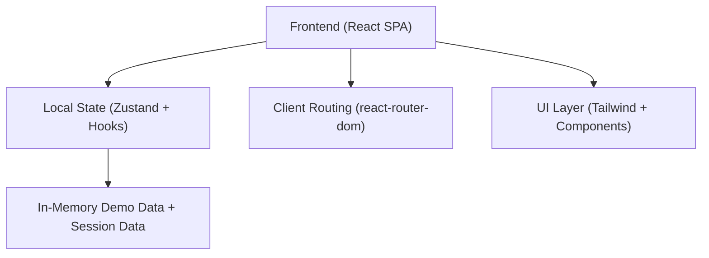

## 1. Architecture Design

## 2. Technology Description
- Frontend: React@18 + TypeScript + tailwindcss@3 + Vite
- Routing: react-router-dom
- State: React hooks for local page state + zustand for cross-page app state (profile, demo team, daily entries)
- Backend: None (single page application with mock/demo data only)
- Persistence: Optional localStorage (only if needed for demo continuity); default is in-memory per session

## 3. Route Definitions
| Route | Purpose |
|-------|---------|
| / | Landing + Setup (role selection + onboarding) |
| /employee | Employee daily coaching: check-in → recommendation → feedback |
| /owner | Owner dashboard: adoption metrics, team list, department chart |

## 4. API Definitions
No backend APIs. “AI recommendation” is generated client-side from deterministic rules over the employee’s inputs (task keywords → tool + prompt template).

## 5. Data Model

### 5.1 Type Definitions (TypeScript)
- UserRole: `"employee"` \| `"owner"`
- DepartmentRole: `"Marketing"` \| `"Sales"` \| `"Finance"` \| `"Developer"` \| `"Operations"` \| `"HR"`

Employee
- EmployeeProfile:
  - id: string
  - name: string
  - role: DepartmentRole

Owner
- OwnerProfile:
  - companyName: string
  - teamSize: number

Daily Coaching
- MorningCheckIn:
  - dateISO: string
  - workingOn: string
  - timeSink: string
  - toolsTried: string
- AiRecommendation:
  - toolName: string
  - whyThisTool: string
  - promptTemplate: string
  - estimatedMinutesSaved: number
- EndOfDayFeedback:
  - helped: boolean
  - minutesSaved: number

Team Dashboard (demo data)
- TeamMember:
  - id: string
  - name: string
  - role: DepartmentRole
  - department: DepartmentRole
  - activeToday: boolean
  - minutesSavedToday: number

### 5.2 Derived Metrics
- Team AI Adoption Rate: activeToday / totalMembers
- Total Time Saved This Week: sum(minutesSavedToday) across days (demo uses realistic weekly aggregate derived from seeded values)
- Department Adoption: group by department → active count + total count

## 6. UI Composition (High Level)
- AppShell: global background, header, and route transitions
- Pages
  - LandingSetupPage
  - EmployeeDailyCoachingPage
  - OwnerDashboardPage
- Reusable components
  - Card, Button, Input, Textarea, Select
  - StatTile (KPI)
  - ProgressBar
  - DepartmentBarChart (simple div-based chart)

## 7. Key Implementation Notes
- Keep UI components small and reusable; no dynamic imports for routes.
- Use Tailwind for all styling; define primary color tokens via CSS variables if needed.
- Smooth transitions: CSS transitions + route-level enter/exit animation (no heavy animation dependencies unless already installed).
- “Specific tool” recommendations: map common work intents to concrete tools (e.g., “Jasper” for marketing copy, “Perplexity” for research briefs, “Cursor” for coding refactors, “Harvey” for legal drafts, etc.) with prompts tailored to the input fields.
