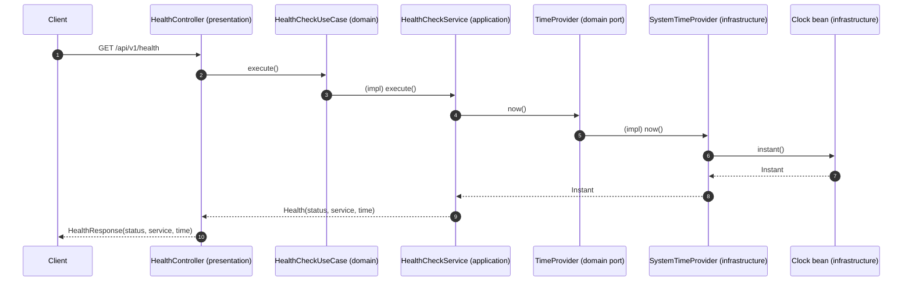
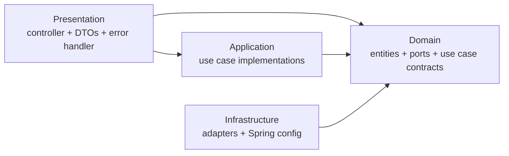

# Code Wiki — TRAE Hackathon Starter

## 1) Overview

This repository is a small “hackathon starter” that pairs:

- A static HTML/CSS landing page (no build tooling)
- A minimal Spring Boot backend exposing a single health endpoint

The backend code is intentionally structured with clear layering (presentation → application → domain → infrastructure) so it’s easy to extend during a hackathon.

## 2) Repository Layout

```
.
├─ backend/                  # Spring Boot (Java 17, Maven)
│  ├─ pom.xml
│  ├─ README.md
│  └─ src/main/
│     ├─ java/com/hackathon/demo/
│     │  ├─ DemoApplication.java
│     │  ├─ presentation/    # HTTP controllers, DTOs, exception mapping
│     │  ├─ application/     # Use case implementations
│     │  ├─ domain/          # Entities + ports + use case contracts
│     │  └─ infrastructure/  # Adapter implementations + Spring config
│     └─ resources/
│        └─ application.properties
├─ frontend/                 # Static landing page (open in browser)
│  ├─ index.html
│  └─ style.css
└─ docs/                     # Static site copy (GitHub Pages style)
   ├─ index.html
   ├─ style.css
   └─ .nojekyll
```

## 3) Architecture

### 3.1 Runtime components

- **Backend service**: Spring Boot web app (embedded servlet container via `spring-boot-starter-web`)
- **Frontend**: Static HTML/CSS that shows a static example of the backend response
- **Docs site**: Same static page content for publishing (mirrors `frontend/`)

### 3.2 Backend layering (responsibilities)

- **Presentation** (`com.hackathon.demo.presentation.*`)
  - Owns HTTP concerns: routes, DTO shapes, exception-to-JSON mapping
  - Depends on domain *interfaces* (use case contracts)
- **Application** (`com.hackathon.demo.application.*`)
  - Implements use cases; orchestrates domain + ports + configuration
  - Depends on domain types/ports, but not on web/transport types
- **Domain** (`com.hackathon.demo.domain.*`)
  - Owns core entities, use case interfaces, and “ports” (interfaces) such as time retrieval
  - Should have minimal dependency surface (mostly JDK types)
- **Infrastructure** (`com.hackathon.demo.infrastructure.*`)
  - Provides implementations for domain ports and Spring configuration beans

### 3.3 End-to-end request flow

`GET /api/v1/health` travels through the system like this:



## 4) Major Modules

### 4.1 Backend (`backend/`)

**Build & runtime**
- Maven project: [pom.xml](file:///d:/Project/Hachaton%20TRAE/backend/pom.xml)
- Runtime config: [application.properties](file:///d:/Project/Hachaton%20TRAE/backend/src/main/resources/application.properties)

**Packages**
- `com.hackathon.demo.presentation`: HTTP API and response shapes
- `com.hackathon.demo.application`: use case implementations
- `com.hackathon.demo.domain`: core interfaces and entities
- `com.hackathon.demo.infrastructure`: adapters and Spring wiring

### 4.2 Frontend (`frontend/`)

- Static page: [index.html](file:///d:/Project/Hachaton%20TRAE/frontend/index.html)
- Styling: [style.css](file:///d:/Project/Hachaton%20TRAE/frontend/style.css)
- Notes:
  - The “Demo” section displays a hardcoded JSON example (no live API call).
  - “Cara Menjalankan” explains opening the HTML file directly and running the backend.

### 4.3 Docs (`docs/`)

- Mirrors the frontend content for static publishing:
  - [docs/index.html](file:///d:/Project/Hachaton%20TRAE/docs/index.html)
  - [docs/style.css](file:///d:/Project/Hachaton%20TRAE/docs/style.css)

## 5) Key Classes and Functions (Backend)

### 5.1 Bootstrap / entrypoint

- [DemoApplication](file:///d:/Project/Hachaton%20TRAE/backend/src/main/java/com/hackathon/demo/DemoApplication.java#L1-L11)
  - Starts the Spring application context.
  - Key function: `main(String[] args)` which delegates to `SpringApplication.run(...)`.

### 5.2 Presentation layer (HTTP)

- [HealthController](file:///d:/Project/Hachaton%20TRAE/backend/src/main/java/com/hackathon/demo/presentation/controller/HealthController.java#L1-L24)
  - Route base: `@RequestMapping("/api/v1")`
  - Endpoint: `@GetMapping("/health")`
  - Key function: `health()`
    - Calls [HealthCheckUseCase](file:///d:/Project/Hachaton%20TRAE/backend/src/main/java/com/hackathon/demo/domain/usecase/HealthCheckUseCase.java#L1-L7)
    - Maps domain [Health](file:///d:/Project/Hachaton%20TRAE/backend/src/main/java/com/hackathon/demo/domain/entity/Health.java#L1-L6) into DTO [HealthResponse](file:///d:/Project/Hachaton%20TRAE/backend/src/main/java/com/hackathon/demo/presentation/model/HealthResponse.java#L1-L6)

- [HealthResponse](file:///d:/Project/Hachaton%20TRAE/backend/src/main/java/com/hackathon/demo/presentation/model/HealthResponse.java#L1-L6)
  - Response DTO record: `(status, service, time)`

- [GlobalExceptionHandler](file:///d:/Project/Hachaton%20TRAE/backend/src/main/java/com/hackathon/demo/presentation/error/GlobalExceptionHandler.java#L1-L23)
  - `@RestControllerAdvice` that maps any uncaught `Exception` to an `ErrorResponse` with HTTP 500.
  - Key function: `handle(Exception ex, HttpServletRequest request)`

- [ErrorResponse](file:///d:/Project/Hachaton%20TRAE/backend/src/main/java/com/hackathon/demo/presentation/error/ErrorResponse.java#L1-L6)
  - Error DTO record: `(status, error, message, path, time)`

### 5.3 Domain layer (core contracts)

- [Health](file:///d:/Project/Hachaton%20TRAE/backend/src/main/java/com/hackathon/demo/domain/entity/Health.java#L1-L6)
  - Domain record representing the service health state.
  - Fields: `status` (string), `service` (string), `time` (`Instant`)

- [HealthCheckUseCase](file:///d:/Project/Hachaton%20TRAE/backend/src/main/java/com/hackathon/demo/domain/usecase/HealthCheckUseCase.java#L1-L7)
  - Use case contract for producing a `Health` snapshot.
  - Key function: `Health execute()`

- [TimeProvider](file:///d:/Project/Hachaton%20TRAE/backend/src/main/java/com/hackathon/demo/domain/repository/TimeProvider.java#L1-L7)
  - Domain “port” abstraction for retrieving the current time.
  - Key function: `Instant now()`

### 5.4 Application layer (use case implementation)

- [HealthCheckService](file:///d:/Project/Hachaton%20TRAE/backend/src/main/java/com/hackathon/demo/application/usecase/HealthCheckService.java#L1-L23)
  - `@Service` implementing [HealthCheckUseCase](file:///d:/Project/Hachaton%20TRAE/backend/src/main/java/com/hackathon/demo/domain/usecase/HealthCheckUseCase.java#L1-L7)
  - Constructor injects:
    - A domain port: [TimeProvider](file:///d:/Project/Hachaton%20TRAE/backend/src/main/java/com/hackathon/demo/domain/repository/TimeProvider.java#L1-L7)
    - A config value: `@Value("${app.service-name}")` from [application.properties](file:///d:/Project/Hachaton%20TRAE/backend/src/main/resources/application.properties)
  - Key function: `execute()` returns `new Health("UP", serviceName, timeProvider.now())`

### 5.5 Infrastructure layer (adapters + configuration)

- [SystemTimeProvider](file:///d:/Project/Hachaton%20TRAE/backend/src/main/java/com/hackathon/demo/infrastructure/time/SystemTimeProvider.java#L1-L20)
  - `@Component` implementing the domain [TimeProvider](file:///d:/Project/Hachaton%20TRAE/backend/src/main/java/com/hackathon/demo/domain/repository/TimeProvider.java#L1-L7)
  - Uses injected `java.time.Clock` to generate an `Instant` (`clock.instant()`).

- [TimeConfig](file:///d:/Project/Hachaton%20TRAE/backend/src/main/java/com/hackathon/demo/infrastructure/config/TimeConfig.java#L1-L13)
  - `@Configuration` providing a `Clock` bean.
  - Key function: `clock()` returns `Clock.systemUTC()`

## 6) Dependency Relationships

### 6.1 External dependencies (backend)

Declared in [pom.xml](file:///d:/Project/Hachaton%20TRAE/backend/pom.xml#L1-L39):

- **Spring Boot 3.3.1** (`spring-boot-starter-parent`)
- **Web starter** (`spring-boot-starter-web`)
- **Build plugin** (`spring-boot-maven-plugin`)
- **Java version**: 17

There is no frontend build system (no Node.js tooling, no `package.json`).

### 6.2 Internal dependencies (backend)

High-level module dependency direction:



Notes:
- **Domain is depended on by other layers**, but does not depend on them.
- **Infrastructure provides implementations** for domain ports (e.g., `TimeProvider`).
- **Presentation depends on the use case interface**, which is implemented by the application layer and injected by Spring.

## 7) API Reference

### 7.1 Health endpoint

- Method: `GET`
- Path: `/api/v1/health`
- Handler: [HealthController.health()](file:///d:/Project/Hachaton%20TRAE/backend/src/main/java/com/hackathon/demo/presentation/controller/HealthController.java#L19-L23)
- Response: [HealthResponse](file:///d:/Project/Hachaton%20TRAE/backend/src/main/java/com/hackathon/demo/presentation/model/HealthResponse.java#L1-L6)

Example response (from [backend/README.md](file:///d:/Project/Hachaton%20TRAE/backend/README.md#L15-L19)):

```json
{"status":"UP","service":"hackathon-backend","time":"2026-05-30T10:15:30Z"}
```

### 7.2 Error response format

- Handler: [GlobalExceptionHandler](file:///d:/Project/Hachaton%20TRAE/backend/src/main/java/com/hackathon/demo/presentation/error/GlobalExceptionHandler.java#L1-L23)
- Shape: [ErrorResponse](file:///d:/Project/Hachaton%20TRAE/backend/src/main/java/com/hackathon/demo/presentation/error/ErrorResponse.java#L1-L6)

## 8) Configuration

Backend configuration is currently a plain properties file:

- [application.properties](file:///d:/Project/Hachaton%20TRAE/backend/src/main/resources/application.properties#L1-L2)
  - `server.port=8080`
  - `app.service-name=hackathon-backend`

The service name is injected into [HealthCheckService](file:///d:/Project/Hachaton%20TRAE/backend/src/main/java/com/hackathon/demo/application/usecase/HealthCheckService.java#L14-L22) via `@Value("${app.service-name}")`.

## 9) How to Run

### 9.1 Prerequisites

- Java 17 (required by [pom.xml](file:///d:/Project/Hachaton%20TRAE/backend/pom.xml#L20-L22))
- Maven CLI (`mvn`) available on PATH

### 9.2 Run backend (development)

From the repository root:

```bash
mvn -f backend/pom.xml spring-boot:run
```

Then verify:

```bash
curl -s http://localhost:8080/api/v1/health
```

Reference: [backend/README.md](file:///d:/Project/Hachaton%20TRAE/backend/README.md#L1-L13)

### 9.3 Build backend (jar)

```bash
mvn -f backend/pom.xml clean package
```

Run the packaged jar (artifact name is defined in [pom.xml](file:///d:/Project/Hachaton%20TRAE/backend/pom.xml#L14-L18)):

```bash
java -jar backend/target/demo-backend-0.0.1-SNAPSHOT.jar
```

### 9.4 Run frontend

- Open [frontend/index.html](file:///d:/Project/Hachaton%20TRAE/frontend/index.html) directly in your browser.
- The “Demo” JSON is static; it does not fetch the backend endpoint.

### 9.5 Run docs site locally

- Open [docs/index.html](file:///d:/Project/Hachaton%20TRAE/docs/index.html) directly in your browser.

## 10) Extension Points (Where to add features)

- Add a new API endpoint:
  - Create a new controller under `com.hackathon.demo.presentation.controller`
  - Define a use case interface under `com.hackathon.demo.domain.usecase`
  - Implement it under `com.hackathon.demo.application.*` and inject required ports
- Add a new external integration (DB, HTTP client, etc.):
  - Define a domain port interface under `com.hackathon.demo.domain.repository` (or a more specific `domain.port` package if you add one)
  - Implement it under `com.hackathon.demo.infrastructure.*` and wire it with Spring beans

